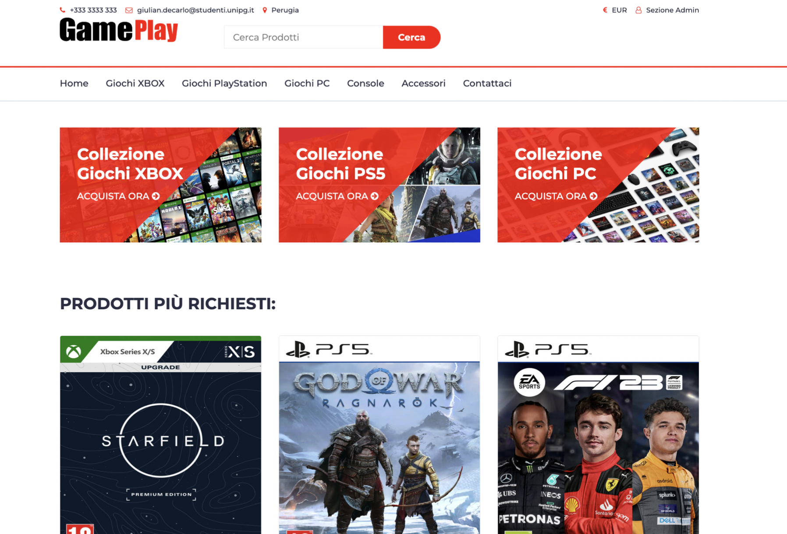

# 
GamePlay

The project consists of a web application that serves as a commercial platform for selling video games and consoles. Project done for web and mobile programming exam. The application targets two types of users: customers and site administrators.

## Customer Features

Customers have access to the following functionalities:

- View products on the homepage.
- Access detailed information about a specific product on its dedicated page.
- Purchase video games and consoles.

## Administrator Features

Administrators have access to the following functionalities:

- Manage the site through an administration section.
- Check the latest orders placed by customers.
- Add, edit, or remove products from the platform.

The goal of this project is to create a user-friendly and interactive e-commerce platform where customers can easily find and purchase video games and consoles, while administrators have the necessary tools to manage and update the product inventory efficiently.

##

